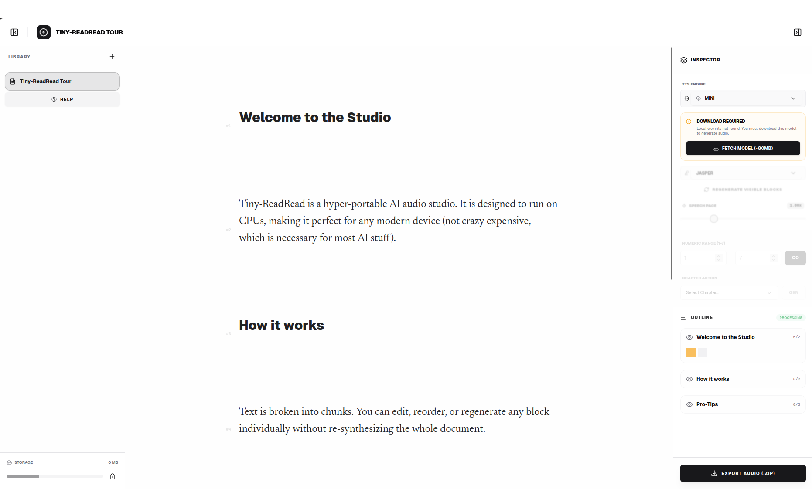

# 🎙️ Tiny-ReadRead (TRR)


*(Caption: The Tiny-ReadRead Studio interface in action)*

**A hyper-portable, containerized, local-first Text-to-Speech (TTS) studio optimized for maximum speed and minimal hardware.**

Tiny-ReadRead is a streamlined application designed to process text into high-quality spoken audio using hyper-optimized AI models (like [Kitten-TTS](https://github.com/KittenML/KittenTTS)). It bridges a highly responsive, modern React frontend with an asynchronous Python backend—all packaged into a single, zero-configuration Docker container.

### !!! Most AI audio tools require 10GB+ of CUDA/GPU environments. TRR was engineered for the "Edge"

## 💡 Why This Exists?
1. **Hyper-Portable:** I wanted a solution that works *anywhere*, fast. No Python environment dependency nightmares, no Node version conflicts, no complex setup. If you have Docker, you have a fully functional AI audio studio.
2. **Runs on a Potato:** Designed specifically for lower-end devices. It prioritizes CPU-based, lightweight TTS models that sound great without requiring a dedicated GPU.
3. **Explicit Activity:** Built with a "Human-First" resource model. It never drains your battery by generating audio in the background for hidden projects. You have 100% control over compute usage.

---

## 🛠️ Tech Stack & Engineering Highlights

This project was built with a focus on **maintainability, scalability, and industry standards**, demonstrating full-stack proficiency from infrastructure to UI:

### **Frontend (SPA)**
- **React 19 & TypeScript:** Strongly typed, modern UI component architecture.
- **Vite & TailwindCSS:** Lightning-fast HMR and utility-first styling.
- **State Management:** `Zustand` for local persistence & `TanStack React Query` for server-state caching.
- **Routing:** `@tanstack/react-router` for type-safe routing.

### **Backend (REST API)**
- **Python 3.11 & FastAPI:** High-performance, asynchronous REST framework.
- **SQLAlchemy & SQLModel:** Asynchronous SQLite with WAL (Write-Ahead Logging) enabled for concurrent read/write stability.
- **Reactive Task Queue:** A custom `asyncio`-based worker queue decoupled from the web thread, ensuring API responsiveness during heavy audio synthesis.

### **DevOps, CI/CD & Testing**
- **Docker & Docker Compose:** Multi-stage builds optimizing image size and isolating the build environment from the runtime.
- **Automated Testing:** 
  - `Pytest` + `pytest-asyncio` for robust backend endpoint and worker testing.
  - `Playwright` for End-to-End (E2E) browser testing on critical user paths.
- **Continuous Integration (GitHub Actions):** Automated quality gates running tests, `Biome` (TS linting/formatting), and `Ruff` (Python linting) on every PR.
- **Pre-commit Hooks:** Ensuring code quality and preventing secret leakage before code even leaves the local machine.

---

## 🚀 Quick Start

### Option A: Builds take time: Skip everything

For the fomerly-'heavy' studio version (although it needs to be updated) that is being built in parallel,

**[Click here on vercel (Vercel)](https://read-read-ai.vercel.app/)** 

### Option B: I want to build it locally

To run this project, you only need [Docker](https://docs.docker.com/get-docker/) installed. No other dependencies are required.

**1. Clone the repository:**
```bash
git clone https://github.com/gkegke/TinyReadRead.git
cd TinyReadRad
```

**2. Boot the appliance:**
```bash
# This builds the multi-stage Docker image and handles all dependencies
./run.sh --build
```

**3. Start Creating:**
Open your browser and navigate to: **[http://localhost:7777](http://localhost:7777)**

*(Note: The first time you generate audio, the container will automatically download the ~80MB Kitten-TTS model to its cached volume).*

---

## 🧠 Architectural Decisions

* **Chunk-by-Chunk Processing:** Instead of freezing the UI to process a 10,000-word document, text is segmented via `pysbd` (Python Sentence Boundary Disambiguation). Audio is generated block-by-block, allowing near-instant playback of the first sentence while the rest process in the background.
* **The "Human-First" Latency Principle:** We prioritize native browser implementations (`HTMLAudioElement` over custom `AudioContext` worklets) for superior OS-level media integration, power management, and background play reliability.
* **Database Deadlock Avoidance:** Configured SQLite with a `NullPool`, explicit connection timeouts, and `PRAGMA journal_mode=WAL` to allow the background asyncio worker to synthesize audio without locking the database for user read-requests.

---

## 🔮 Future Roadmap

While currently scoped as a streamlined MVP, the architecture is designed to easily accommodate:
- **Multi-Voice Directing:** Tagging specific chunks with character voices (e.g., "Narrator", "Hero", "Villain") for dynamic, multi-cast audiobooks.
- **AI-Assisted Formatting:** Integrating cheap LLMs to automatically parse raw scripts and apply appropriate chunking/voice tags.
- **High-Fidelity Models:** Abstracted `TTSEngine` interface makes it trivial to drop in heavier models (like Kokoro) when running on beefier hardware.
- **Automated Video Sync:** Expanding the studio to pair generated audio timelines with visual assets.
